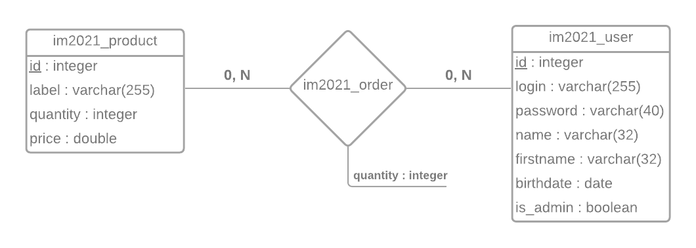

# Projet_Web2

## SOMMAIRE
- [Schémas de la base de données utilisée](#bdd)
  1. [Entité association](#ea)
  2. [Relationnel](#rel)
- [Hiérarchie du projet](#hierarchie)
- [Création d'un service sur Symfony](#service)
- [Points particuliers du framework](#ppf)

## Schémas de la base de données utilisée <a id="bdd"/>

### i. Entité association <a id="ea"/>



### ii. Relationnel <a id="rel"/>


**Entity.client** est une clé étrangère de **im2021_user**<br>
**Entity.product** est une clé étrangère de **im2021_product**

Symfony ajoutant une clé primaire automatiquement, 
nous avons dû ajouter une contrainte unique 
sur les champs `client` et `produit` afin d'en faire notre clé primaire.

## Hiérarchie du projet <a id="hierarchie"/>

```
src/
│   Kernel.php
│
├───Controller
│    ├─── .gitignore
│    ├─── AccountController.php     # Contient toutes les actions relatives aux comptes
│    ├─── AdminController.php       # Contient les actions accessibles uniquement par l'admin
│    ├─── MenuController.php        # Contient l'action pour le menu (inclut dans le twig)
│    └─── ProductController.php     # Contient les actions relatives à la gestion des produits
│
├───DataFixtures
│    └─── AppFixtures.php
│
├───Entity                          # Contient les classes relatives aux tables de la base de données
│    ├─── .gitignore
│    ├─── Order.php  
│    ├─── Product.php 
│    └─── User.php     
│
├───Form                            # Contient les formulaires des entités
│    ├─── OrderType.php           
│    ├─── ProductType.php
│    └─── UserType.php
│
└───Repository                      # Contient les répertoire des entités
     ├─── .gitignore
     ├─── OrderRepository.php
     ├─── ProductRepository.php
     └─── UserRepository.php
```

```
templates/
├─── base.html.twig
│
├───commons                         # Contient tous les templates twig desquelles nous allons hériter
│    ├─── _base.html.twig
│    ├─── _body.html.twig
│    ├─── _flash.html.twig
│    ├─── _footer.html.twig
│    ├─── _layout.html.twig
│    └─── _menu.html.twig
│
├───menu                            # Contient le template du menu
│    └─── index.html.twig
│
└───vues                            # Contient les vues des actions ...
    ├───account                     # du controller account
    │    ├─── connect.html.twig
    │    ├─── createAccount.html.twig
    │    ├─── disconnect.html.twig
    │    ├─── editProfile.html.twig
    │    └─── welcome.html.twig
    │
    ├───admin                      # du controller admin
    │    ├─── addProduct.html.twig
    │    ├─── editProduct.html.twig
    │    ├─── editProducts.html.twig
    │    ├─── editUser.html.twig
    │    └─── listUsers.html.twig
    │
    └───product                   # du controller product
         ├─── listOrders.html.twig
         ├─── orders.html.twig
         └─── productList.html.twig

```

```
public/
├───css                          # Contient toutes les feuilles de styles globales et pour chaque controller
│   ├───account
│   ├───admin
│   └───product
└───images                      # Contient les images du site
```

## Création d'un service sur Symfony <a id="service"/>

Avant de procéder à la création d'un service sous Symfony, nous allons expliquer briévement ce
à quoi cela correspond.

Un service ([selon M. Achref El Mouelhi](http://www.lsis.org/elmouelhia/courses/php/sf/coursSymfonyServices.pdf))
est une classe PHP ne réalisant qu'une seule fonctionnalité (envoi de mail, manipulation dans la base de donnée, ...)
qui se veut accessible partout dans le code et injectable dans les classes qui en ont besoin. Il a un
identifiant qui est son nom de classe.

Pour notre projet nous avons décider de faire un service inversant une chaîne de caractères et de l'afficher sur la
page d'accueil.

Dans un premier temps créé notre service dans le dossier `src/Services` :
```php
namespace App\Services;

class InvertString
{
    // retourne la chaîne de caractère inversé
    public function getInvertString(string $str) : string
    {
        return strrev($str);
    }
}
```
Ensuite, pour pouvoir utiliser le service nous devons passer un objet du type en paramètre d'une action qui souhaite
l'utiliser :

```php
public function action(InvertString $invertString)
{
    ...
    
    $inverted = $invertString->getInvertString("string"); // retourne "gnirts"
    
    ...
}
```

## Points particuliers du framework <a id="ppf"/>